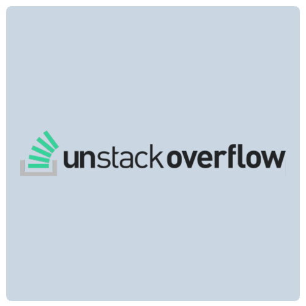
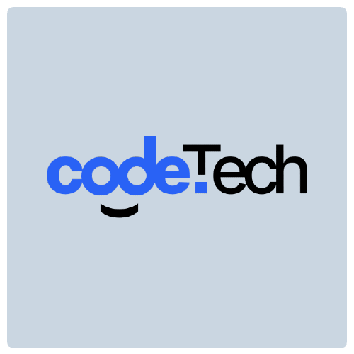

저는 개발이 세상에 새로운 것을 창조할 수 있다고 생각하는 편입니다.   
그래서 개발을 좋아하고 새로운 기술을 배우고자 노력합니다.   
제가 개발하거나 참여한 프로젝트를 소개합니다.

<table>
    <thead>
        <tr>
            <th>Logo</th>
            <th>Title</th>
            <th>Description</th>
            <th>References</th>
        </tr>
    </thead>
    <tbody>
        <tr>
            <td></td>
            <td>Unstackoverflow Clone coding</td>
            <td>유명한 해외 코딩 커뮤니티인 스택오버플로우를 재해석해 클론코딩 프로젝트를 진행 했습니다.</td>
            <td><a target="_blank" href="https://github.com/laterre39/unstackoverflow-service">github</a></td>
        </tr>
        <tr>
            <td></td>
            <td>codeTech</td>
            <td>컴팩트한 정보로 보다 좋은 UX를 제공하고자 코드테크 프로젝트를 시작하게 됐습니다.</td>
            <td><a target="_blank" href="https://github.com/laterre39/codetech-service">github</a></td>
        </tr>
    </tbody>
</table>
